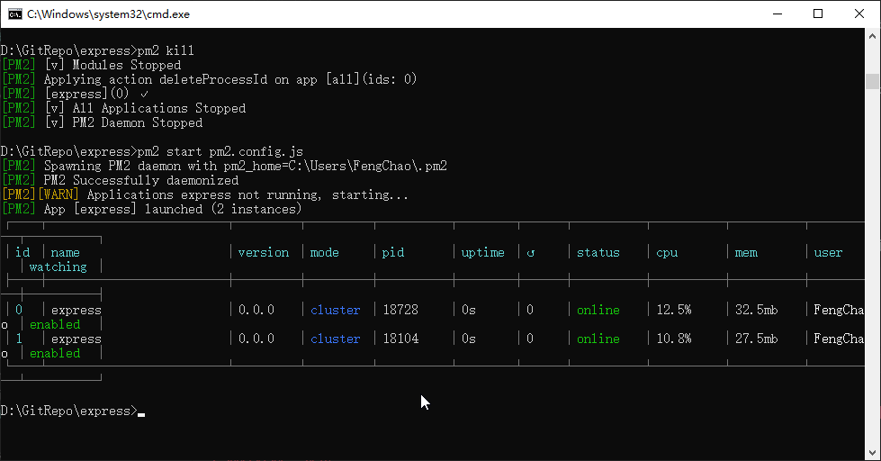

# [turf.js](http://turfjs.org/docs/) node server
## 安装
```
npm install
```
## 运行
```
npm run start
```
## 部署
1. 安装node进程管理工具[PM2](https://pm2.keymetrics.io/)
   ```
   npm install pm2 -g
   ```
2. 配置PM2配置文件 pm2.config.js
   ```
   module.exports = {
     apps: [
       {
         name: "express", // app name in pm2
         script: "./bin/www",
         watch: true,
         instances: 2, // 启动实例
         exec_mode: "cluster", // 多服务模式
         increment_var: 'PORT', // 一个实例对应一个端口，端口自增
         env: {
           "PORT": 3000,
           "NODE_ENV": "development"
         },
         env_prod: {
           "PORT": 80,
           "NODE_ENV": "production",
         }
       }
     ]
   }
   ```
3. 启动服务
   ```
   pm2 start pm2.config.js --env prod
   ```
   
   按如上配置运行后 ip:80 或 ip:81 都可访问接口
## turf 接口目录
`/routes/turf.js`

获取最短路径接口
`http://localhost:3000/turf/shortestPath`
